<h1 align="center">Hi 👋, I'm M SRAVANTHI</h1>
<h3 align="center">B.Tech AI graduate passionate about cutting-edge technology and its transformative potential. Having specialized in Artificial Intelligence, I’ve built a strong foundation in machine learning, deep learning, NLP, and computer vision. I’ve actively contributed to multiple projects and stayed updated with the latest advancements in AI. Currently, I aim to apply my knowledge to solve real-world challenges and contribute to the development of impactful, cloud-integrated technologies.
.</h3>

  

  

- 🌱 I’m currently learning **Gen AI**

- 📫 How to reach me **sravanthim674@gmail.com**

<h3 align="left">Connect with me:</h3>

<h3 align="left">Languages and Tools:</h3>

 
  <!-- Languages -->
  
  
  
  
  

  <!-- Frameworks & Libraries -->
  
  
  
  
  
  
  
  
  

  <!-- Tools -->
  
  
  
  
  
  
  

&nbsp;

